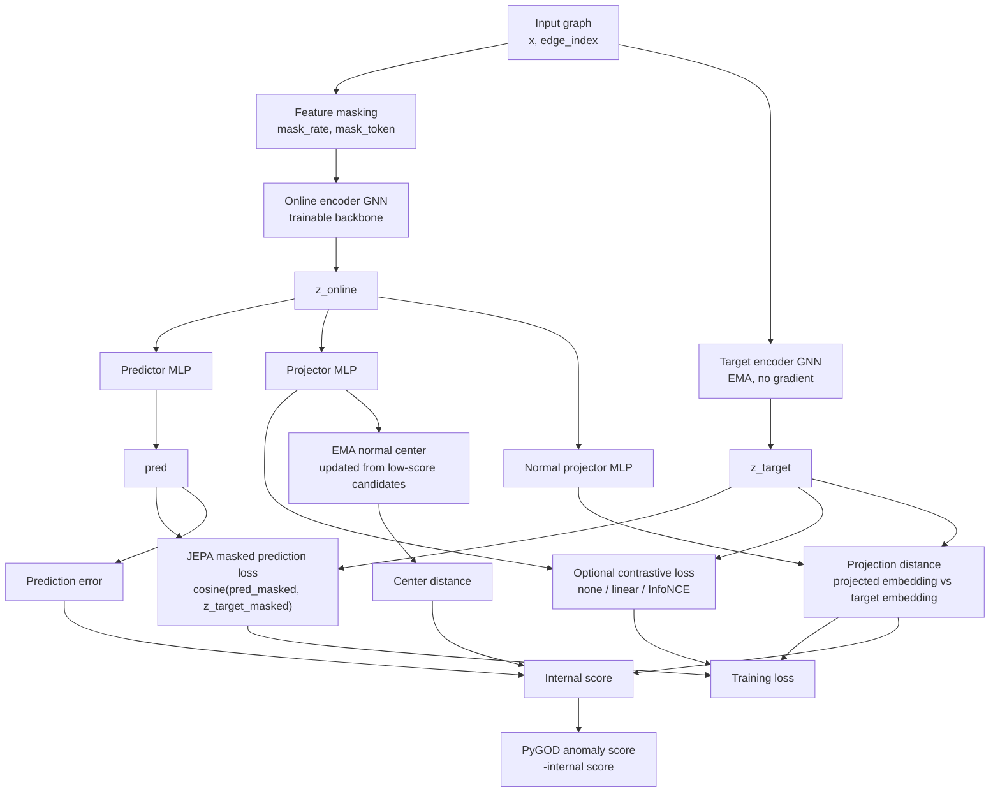

# GADJEPA Experiment Notes

This fork starts from PyGOD and adds `GADJEPA`, a JEPA/BYOL-style graph
anomaly detector for masked semantic representation learning.

## Changes in This Fork

- Added `GADJEPA` as a PyGOD detector in `pygod/detector/jepa.py`.
- Added `GADJEPABase` in `pygod/nn/jepa.py`.
- Registered the new detector in `pygod/detector/__init__.py` and
  `pygod/nn/__init__.py`.
- Added `gadjepa` to the benchmark model factory in `benchmark/utils.py`.
- Added `--epoch` and `--num_trial` to `benchmark/main.py` for controlled
  quick runs.
- Updated PyTorch 2.6+ loading compatibility by passing
  `weights_only=False` when loading PyG `Data` objects.
- Added `pygod/test/test_jepa.py` to cover the new detector path.

## Why PyGOD

PyGOD already provides the pieces needed for first experiments:

- Dataset loading via `pygod.utils.load_data`, including `inj_cora`,
  `inj_amazon`, `inj_flickr`, `weibo`, `reddit`, `disney`, `books`, and
  `enron`.
- Standard graph anomaly detector API: `fit(data)`, `predict(data)`, and
  `decision_score_`.
- Benchmark scripts in `benchmark/`.
- PyTorch Geometric `Data` objects and swappable PyG backbones.

## Model Stack

`GADJEPA` lives in:

- `pygod/detector/jepa.py`: PyGOD detector wrapper.
- `pygod/nn/jepa.py`: neural module with masking, online/target encoders,
  predictor, projector, normal center, and contrastive losses.

The first implementation contains:

- Graph feature masking through `mask_rate`.
- Online encoder plus EMA target encoder, following the BYOL/JEPA pattern.
- Masked prediction loss between online predictions and target embeddings.
- Asynchronous normal projection through a nonlinear `normal_projector` trained
  on low-error normal candidates, plus an EMA `normal_center`.
- Optional contrastive head with `contrast_mode`:
  - `none`: no contrastive regularization.
  - `linear`: BYOL-style positive alignment without negatives.
  - `infonce`: in-batch contrastive loss for comparison against negative-based
    designs.
- Swappable PyG backbone through `backbone`, e.g. `GCN`, `GAT`, `SAGE`, `GIN`
  if the class follows PyG's model signature.

## Architecture



### Score Components

The neural module computes an internal score:

```text
internal_score = prediction_error + projection_distance + center_distance
```

The detector wrapper returns:

```text
anomaly_score = -internal_score
```

This keeps PyGOD's convention that larger `decision_score_` means more
anomalous.

## Quick Experiments

Install a compatible PyTorch/PyG environment first. PyGOD requires
`torch>=2.0.0` and `torch_geometric>=2.3.0`; Python 3.10 or 3.11 is the safer
choice for PyTorch/PyG.

On this Windows workspace, the tested CPU environment was created with:

```bash
uv python install 3.11
uv venv --python 3.11 .venv
uv pip install --python .venv/Scripts/python.exe torch --index-url https://download.pytorch.org/whl/cpu
uv pip install --python .venv/Scripts/python.exe torch_geometric numpy scipy scikit-learn requests tqdm pytest pyod
uv pip install --python .venv/Scripts/python.exe pyg_lib torch_sparse -f https://data.pyg.org/whl/torch-2.12.0+cpu.html
uv pip install --python .venv/Scripts/python.exe -e .
```

Run a benchmark dataset:

```bash
python benchmark/main.py --model gadjepa --dataset inj_cora --gpu -1
```

Compare against contrastive and reconstruction baselines:

```bash
python benchmark/main.py --model conad --dataset inj_cora --gpu -1 --epoch 100 --num_trial 5
python benchmark/main.py --model dominant --dataset inj_cora --gpu -1 --epoch 100 --num_trial 5
python benchmark/main.py --model gadjepa --dataset inj_cora --gpu -1 --epoch 100 --num_trial 5
```

Use the detector directly:

```python
from pygod.detector import GADJEPA
from pygod.utils import load_data

data = load_data("inj_cora")
detector = GADJEPA(epoch=100, hid_dim=64, mask_rate=0.3,
                   contrast_mode="linear", contrast_weight=0.1,
                   normal_weight=0.5)
detector.fit(data)
score = detector.decision_score_
```

## Current Baseline Results

*(Note: All GADJEPA results denote the use of the default GCN backbone)*

### `inj_cora`

These results were run locally on `inj_cora` with CPU, `epoch=100`, and
`num_trial=5`.

| Model | AUC | AP | Recall |
| --- | ---: | ---: | ---: |
| CONAD | 0.7406 +/- 0.0673 (max 0.8022) | 0.1571 +/- 0.0421 (max 0.1841) | 0.2275 +/- 0.0843 (max 0.2971) |
| DOMINANT | 0.7873 +/- 0.0377 (max 0.8337) | 0.1896 +/- 0.0155 (max 0.2109) | 0.2667 +/- 0.0197 (max 0.2971) |

Earlier smoke-test runs for `GADJEPA` used only `epoch=10`, `num_trial=1`, so
they are not comparable to the table above. A fair `GADJEPA` run should use the
same `epoch=100`, `num_trial=5` setting.

### `reddit`

These results were run locally on `reddit` with CPU, `epoch=100`, and `num_trial=20`.

| Model | AUC | AP | Recall |
| --- | ---: | ---: | ---: |
| GADJEPA | 0.5804 +/- 0.0092 | 0.0412 | - |

**Grid Search / Ablation Study (`epoch=100`, `num_trial=5`)**
The table below highlights key findings from the hyperparameter grid search:

| Mask Rate | Contrast Mode | Normal Weight | AUC | AP |
| :---: | :---: | :---: | :---: | :---: |
| 0.1 | none | 0.0 | 0.5660 ± 0.0244 | 0.0392 |
| 0.1 | none | 0.5 | 0.5711 ± 0.0131 | 0.0397 |
| 0.1 | linear | 0.0 | 0.5656 ± 0.0129 | 0.0389 |
| 0.1 | linear | 0.5 | 0.5766 ± 0.0076 | 0.0398 |
| 0.1 | infonce | 0.0 | 0.5717 ± 0.0095 | 0.0416 |
| 0.1 | infonce | 0.5 | **0.5804 ± 0.0092** | **0.0412** |
| 0.3 | none | 0.0 | 0.5336 ± 0.0200 | 0.0354 |
| 0.3 | none | 0.5 | 0.5352 ± 0.0147 | 0.0359 |
| 0.3 | linear | 0.0 | 0.5375 ± 0.0078 | 0.0352 |
| 0.3 | linear | 0.5 | 0.5361 ± 0.0082 | 0.0357 |
| 0.3 | infonce | 0.0 | 0.5618 ± 0.0121 | 0.0393 |
| 0.3 | infonce | 0.5 | 0.5623 ± 0.0042 | 0.0402 |
| 0.5 | none | 0.0 | 0.5189 ± 0.0139 | 0.0339 |
| 0.5 | none | 0.5 | 0.5269 ± 0.0120 | 0.0353 |
| 0.5 | linear | 0.0 | 0.5132 ± 0.0061 | 0.0338 |
| 0.5 | linear | 0.5 | 0.5135 ± 0.0186 | 0.0332 |
| 0.5 | infonce | 0.0 | 0.5525 ± 0.0190 | 0.0400 |
| 0.5 | infonce | 0.5 | 0.5650 ± 0.0062 | 0.0396 |

- **Best Config Found**: `mask_rate=0.1`, `contrast_mode='infonce'`, `normal_weight=0.5`
- **Best Performance**: AUC = `0.5804 +/- 0.0092` | AP = `0.0412`

*Key Observations:*
1. **Mask Rate Sensitivity**: As expected for sparse graphs like Reddit, lower mask rates (`0.1`) consistently outperform higher rates (`0.3` or `0.5`). High masking destroys too much structural context.
2. **Normal Projection Effectiveness**: For any given mask rate and contrast mode, turning on Normal Projection (`normal_weight=0.5`) almost always improves both the mean AUC and stability (lower variance) compared to `normal_weight=0.0`.
3. **Bug Fix Impact**: The pure JEPA mode (`contrast=none`, `normal_w=0.0`) now correctly reports an AUC > 0.5 (e.g., `0.5660`) after fixing the random noise bug in the scoring function.

#### GAT Backbone Grid Search

The table below highlights the grid search results when replacing the default GCN encoder with the **GAT** backbone:

| Mask Rate | Contrast Mode | Normal Weight | AUC | AP |
| :---: | :---: | :---: | :---: | :---: |
| 0.1 | none | 0.0 | **0.5897 ± 0.0059** | 0.0458 |
| 0.1 | none | 0.5 | 0.5708 ± 0.0319 | 0.0415 |
| 0.1 | linear | 0.0 | 0.5789 ± 0.0197 | 0.0406 |
| 0.1 | linear | 0.5 | 0.5820 ± 0.0285 | 0.0415 |
| 0.1 | infonce | 0.0 | 0.5870 ± 0.0081 | 0.0435 |
| 0.1 | infonce | 0.5 | 0.5714 ± 0.0118 | 0.0405 |
| 0.3 | none | 0.0 | 0.5823 ± 0.0092 | **0.0469** |
| 0.3 | none | 0.5 | 0.5743 ± 0.0133 | 0.0429 |

*Note: GAT shows a significant performance jump overall, reaching an AUC of **0.5897**, highlighting the strength of attention-based neighborhood aggregation for anomaly detection.*

## Research Direction

The purpose of `GADJEPA` is to test whether masked semantic prediction can
reduce two weaknesses of contrastive graph anomaly detection:

- Negative sampling sensitivity: `linear` mode avoids explicit negatives,
  while `infonce` remains available as an ablation.
- Drift handling: the EMA target encoder and normal projection center provide
  slowly moving semantic targets instead of forcing rigid augmentation
  invariance.
- FoundAD-style normal projection: the model learns a lightweight nonlinear
  projector that maps candidate-normal graph embeddings back toward the target
  normal manifold; anomaly scores include the deviation from that projection.

The current implementation is static-graph first because PyGOD's benchmark
datasets are static attributed graphs. The next step is to add a dynamic graph
adapter that yields timestamped snapshots or temporal mini-batches while
keeping the same masked-prediction objective.
